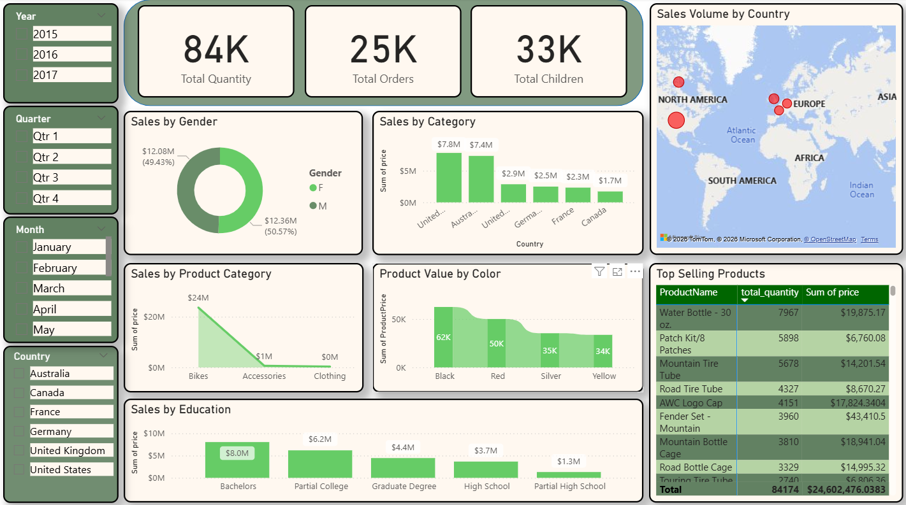

# 🚲 Bicycle Retail Sales & Customer Analytics Dashboard

## 📌 Project Overview
This interactive Power BI dashboard provides a comprehensive analysis of sales performance and customer demographics for a bicycle and accessories retail store.

## 🛠️ Tech Stack & Tools
- **Business Intelligence:** Power BI Desktop

## 🚀 Key Insights & Features
- **Global Sales Distribution:** Interactive map visualization displaying sales volume by country with dynamic bubble indicators.
- **Demographic Breakdown:** Deep dive into customer purchasing behavior segmented by Gender and Education level.
- **Top Performing Products:** Real-time ranking of best-selling products by total quantity and revenue.
- **Product Analysis:** Visual analysis of product sales distribution across categories (Bikes, Accessories, Clothing) and colors.

## 📷 Dashboard Preview

